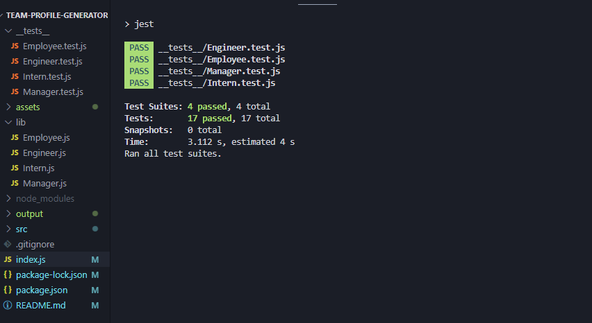

# Team profile generator


### [Deployed site](https://AoifeEdX.github.io/team-profile-generator/)

## About

eam Profile Genrator can be used to create a webpage that displays essential information about a software engineering team's employees, like their job level, IDs, emails and GitHub profiles.

## Installation

Fork the repository and clone it to your local environment with:

```
git clone git@github.com:<user>/team-profile-generator.git
```

Install necessary dependencies with:

```
npm i
```

## Usage

Invoke the app in the root directory of the application with the following terminal command:

```
node index.js
```
Follow the prompts in the terminal to creat your file in the "output" folder.

Your generated file will use pre-existing template:


## Tests

Application uses Jest for testing. 



## Tools

- [Inquirer](https://www.npmjs.com/package/inquirer)

## License

### MIT License

Copyright (c) 2024 AoifeEdX

Permission is hereby granted, free of charge, to any person obtaining a copy of this software and associated documentation files (the "Software"), to deal in the Software without restriction, including without limitation the rights to use, copy, modify, merge, publish, distribute, sublicense, and/or sell copies of the Software, and to permit persons to whom the Software is furnished to do so, subject to the following conditions:

The above copyright notice and this permission notice shall be included in all copies or substantial portions of the Software.

THE SOFTWARE IS PROVIDED "AS IS", WITHOUT WARRANTY OF ANY KIND, EXPRESS OR IMPLIED, INCLUDING BUT NOT LIMITED TO THE WARRANTIES OF MERCHANTABILITY, FITNESS FOR A PARTICULAR PURPOSE AND NONINFRINGEMENT. IN NO EVENT SHALL THE AUTHORS OR COPYRIGHT HOLDERS BE LIABLE FOR ANY CLAIM, DAMAGES OR OTHER LIABILITY, WHETHER IN AN ACTION OF CONTRACT, TORT OR OTHERWISE, ARISING FROM, OUT OF OR IN CONNECTION WITH THE SOFTWARE OR THE USE OR OTHER DEALINGS IN THE
SOFTWARE.
